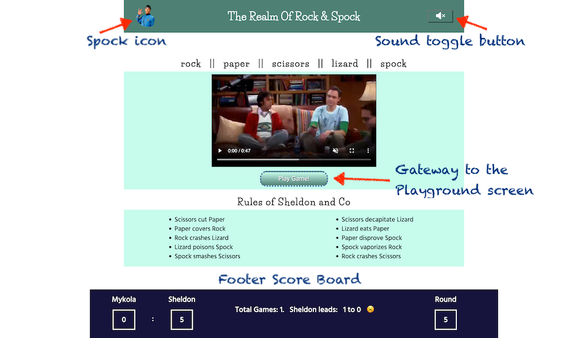
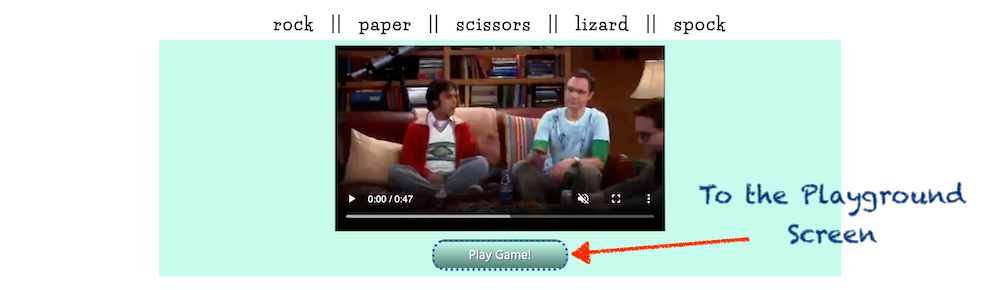
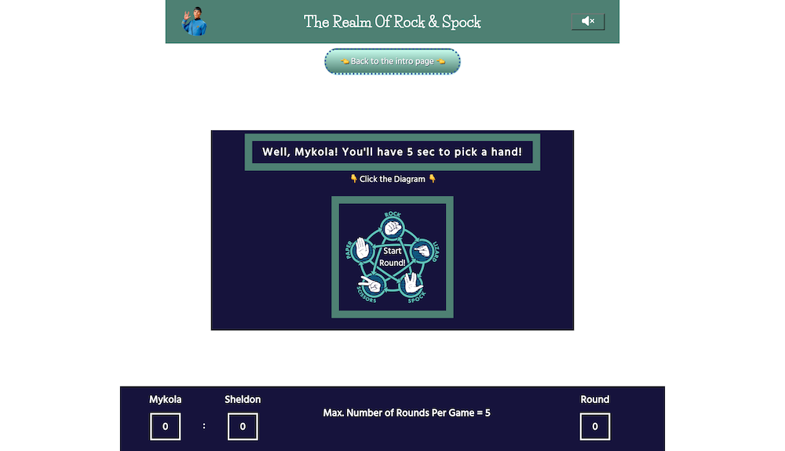

# Rock And Spock
## Introduction
"Rock Paper Scissors Lizard Spock" is an imaginative and humorous expansion of the classic hand game "Rock Paper Scissors," which was ingeniously invented by Sam Kass and Karen Bryla in 1995.

The duo sought to reduce the probability of ties that often occurred in the traditional game, especially among players who knew each other well.
By introducing two additional elements, Lizard and Spock, they created a game that was not only more complex but also injected a fresh dose of fun into the age-old pastime.

The game gained significant popularity after it was featured in the hit television series "The Big Bang Theory," particularly in the episode titled "The Lizard-Spock Expansion" which aired in 2008. The show's character Sheldon Cooper, played by Jim Parsons, famously used the game to settle disputes, explaining the quirky and expanded rules with a sense of comedic seriousness that resonated with audiences. 

This inclusion in the series catapulted "Rock Paper Scissors Lizard Spock" into the limelight, making it a cultural reference point and a beloved variant of the original game.

In this digital version of "Rock Paper Scissors Lizard Spock," players will have the opportunity to engage in a lighthearted battle of chance against a computer opponent. The computer's hand selection is randomly generated, ensuring that each round is unpredictable and entertaining. This game is designed to be a pure game of chance, where strategy takes a backseat to the whims of fortune, providing players with a delightful and amusing diversion from the everyday.

## User Stories
Based on your request, here are four user stories for your JavaScript online game:

1. **Playing the Game**
   - As a player, I want to be able to start a new game so that I can enjoy the gameplay.
   - Acceptance Criteria:
     - The game should have a clear and visible option to start a new game.
     - Upon selecting this option, the game should reset and start a new session.

2. **Understanding the Game Rules**
   - As a player, I want to easily access and understand the game rules so that I can play the game correctly.
   - Acceptance Criteria:
     - The game should provide a clear and concise set of instructions.
     - These instructions should be easily accessible at any point during the game.

3. **Tracking Scores**
   - As a player, I want to track my scores so that I can monitor my progress and performance.
   - Acceptance Criteria:
     - The game should have a feature that keeps track of the player's scores.
     - The score should be visible and updated in real-time as the game progresses.

4. **Interacting with the Game**
   - As a player, I want to interact with the game elements smoothly so that I can have an enjoyable gaming experience.
   - Acceptance Criteria:
     - The game should respond to user inputs promptly and accurately.
     - The game controls should be intuitive and easy to use.

## Existing Features
### Intro Screen and the Gateway to the Playground

* __The Header__

It displays the game Title which is a playfully rhyming paraphrase "Rock & Spock". At the top left there is the icon of Spock character from Star Trek to begin putting Player in the right atmosphere. At the top right is the sound toggle button.

The game have a couple of amusing sounds basically executed as button clicks, but the screen loads with sounds disabled.

* __The Video and the Button__

Player is given an option to see the video segment where Sheldon character explains about the rules of the game and entertains his roommates. The video is a good tool to build an atmosphere for the First Time Player and it is also fun which is worth to watch multiple times. 

The video is equipped with play controls and captions for accessibility reasons and loads muted.

__The Button 'Play Game'__ brings Player to the Playground Screen where he/she can start a new Round.

* __The Rules__

In this section of the Intro screen the rules are repeated in writing in the same manner as they are presented by Sheldon character. Player can take any time to review the rules or just skip them and hit __the Button 'Play Game'__ to start playing.

* __Footer Score Board__

Footer is always underneath the other content and plays the role of the Score Board. The initial Score Board shows Player as You and the Computer as Sheldon. The scores and the Round count are 0.

It also prompts Player that the total session will be divided in Games each consisting of 5 rounds.

### Input Player's Name Screen

Here Computer introduces himself as Sheldon and before Player can engage in the fun of the Rock & Spock Sheldon Computer tenders to input Player's name whatever it might be. The form field is required so Player cannot proceed further until he or she enters the name.

Player is also given the option to return to the Intro screen to review the video or rules.

The name must not contain special characters, otherwise the respective alert pops up.

Once the name is in place the game becomes interactive and personalized. In the first instance, on hitting the button "Send" Player can see  his or her own name or nickname on the scoreboard.

The name is keyed in only once and valid for entire session regardless to the number of Games and Rounds Player wishes to challenge. The Player's name may be changed by reloading the web-page. After reloading the web-page Player must enter his/her name once again.

### Playground Screen

The __Playground__ can be reached in several ways:
  1. From the _Name Input Screen_ - in the beginning of the gaming session
  
  On hitting the __Send__ button inside Name Input Form (in case the name is keyed in and contains no special characters) Player gets to the Playground immediately without returning to the Intro Screen.

  

  2. From the _Intro Screen_ - if the valid name has been already sent once.

  On hitting the __Play Game__ button underneath the video.

  

  3. From the _Display Results Screen_ when Round has been played.

  On hitting __Back To New Round__ button or should Player does not hit any button for whatever reason when Round has been finished the __Playground Screen__ appears in 10 sec automatically.

  

  The features of this screen include:

  

  - the _Header_ available across all screens with __Sound Toggle__ button  
  - the _Footer_ with the Score Board to see how many Rounds in the Game has been played
  - Central Element consisting of
    - the personal address to Player by his/her name and a warning that Player will have only 5 sec to pick a hand
    - Pointer '_Click the Diagram_ '
    - The button __Start Round__ itself that launches the Round

  The __Start Round__ button is designed in the form of a rectangle. Inside the rectangle there is a smart diagram reminding about rules of the Game on the base of available hands.

The button title 'Start Round' fades in and out like flashing beacon effect.

In addition:
  * For laptops and desktops equipped with mouse there is a hover effect of lighting border

   

  * For the touch devices like tablets and smart phones the border is on infinite animation

   

  ### Clock and hands Screen

  It opens when Player hits the __Start Round!__ button.

This is where the 5 hands appear to pick. Each hand is a sketch of a hand in its specific sign imitation that makes the game closer to the real and more challenging.

By means of clock running and countdown numbers Player is encouraged to rush and pick a hand. Putting it within time constraints makes the game more dynamic, and exciting. 

### Display Results Screen

Should Player fail to pick a hand within 5 seconds the Computer increments its score and Player is considered as lost his/her Round.

Player can return to the _Playground_ by hitting the __Back to New Round__ button.

If Player makes it and picks a hand he or she can see the results and congratulation or commiseration messages.

Once the hand has been picked by Player
* The other hands disappear, only the Player's and Computer's ones remaining displayed.
* Above the two remaining hands titles appear to pinpoint the hand holders
* The title of the Winner is coloured red.
* Footer score Board displays the incremented score or unchanged score if Player and Computer tie up. It also displays the number of rounds played.

### The Guide on Reading Scores

* __Round scores.__ 

The numbers underneath Player's Name and Sheldon the Computer show the respective rounds won. The number underneath the Round title displays number of Rounds played within the particular game.

This particular round was won by the Player Mykola, 1 Round was played in this Game.

This board shows that 4 rounds were played, the score of this Game is 1:2 for Sheldon.

* __Game score.__

When number of Rounds reaches 5, hitting on the button __Back To New Round__ throws Player to the _Intro Screen_ instead of _Playground_. Besides the last Round scores the _Footer Score Board_ displays the information on how many Games have been played and what is the Score by Games.

Here the last Round score was 2 : 3 for Sheldon, 5 rounds were played in the last Game, total number of Games played - three, Sheldon the Computer won two Games straight.  

### Smart Phones in Landscape Mode

Current Design Concept does not assume playing in landscape mode on Smart Phone devices. At the same time the game looks good and playable on all standard smart phone sizes in portrait mode. To avoid inconveniences for Player the banner was developed with a request to get back to portrait mode. The banner appears only for the screen widths less than 933px and orientation mode: landscape.

## Features Left To Implement

* Landscape Mode for Mobiles

When there is time I would like to rearrange design and make it suitable for landscape modes for smart phones. Currently, the game is designed to be played on a web browser. However, developing a mobile application would be a better solution for mobiles to handle all orientation modes and issues with rendering and handling different screen sizes such as sliding top menus and address bars. 

* Network Solution for Multiplayer Mode

Currently, the game "Rock Paper Scissors Lizard Spock" is designed to be played against the computer. However, it would be a significant enhancement to implement a network solution that allows players to register and compete against each other.

* Player Statistics and Ratings

Alongside the multiplayer feature, it would be beneficial to store individual player statistics and publish ratings. This would involve storing data such as the number of games won, lost, and played by each player. 

* Chat Rooms and Championships

To foster a sense of community among players, chat rooms could be implemented. This would allow players to communicate with each other in real-time, discuss strategies, and arrange games. 

## Testing

For the testing documentation and descriptions please refer to [TESTING.md](TESTING.md)

## Deployment

- This site was deployed to GitHub pages. Follow the steps below to deploy: 
  - In the [GitHub repository](https://github.com/Mykola-CI/rock-and-spock), navigate to the Settings tab and hit Pages on the left bar menu
  - From the source section drop-down menu, select __Deploy from a branch__, 
  - From the branch section drop-down menu, select __master__ then click "Save".
  - The page will be automatically refreshed with a detailed ribbon display to indicate the successful deployment.

The live link to the Rock And Spock site can be found [here](https://mykola-ci.github.io/rock-and-spock)

## Credits

### Content
* The atmosphere was inspired by Big Bang Theory series and of course all versions of Star Trek
* The techniques and tricks with css grids and animations were taken from video tutorials of [Kevin Powell](https://www.youtube.com/user/KepowOb) and [Net Ninja](https://www.youtube.com/@NetNinja)
* The setTimeout and Interval methods and many other JS tricks were learned at [Web Dev Simplified](https://www.youtube.com/c/WebDevSimplified)

### Media

The Man Running Inside Clock gif was taken from [Dribbble.com](https://dribbble.com/).
The link to the gif is [here](https://dribbble.com/shots/3205975-Running-out-of-time/attachments/9703363?mode=media)

The Hand Icons were taken from [Free Icons library](https://icon-library.com). The link to the sketches [here](https://www.google.com/imgres?imgurl=https://icon-library.com/images/rock-paper-scissors-icon/rock-paper-scissors-icon-6.jpg&imgrefurl=https://icon-library.com/icon/rock-paper-scissors-icon-5.html&h=335&w=337&tbnid=Ksu56LV0CzMsZM&tbnh=224&tbnw=225&usg=AI4_-kSUiek__ohbP3-sI4SGfecLowMPYg&vet=1&docid=wmNNvIpfZ_RjdM) 

The Diagram on Winning Hands employed for the Start Round button was taken [here](https://www.akshaybahadur.com/post/rock-paper-scissors-lizard-spock) by courtesy of Akshay Bahadur.

Spock images were borrowed at [Amino Apps](https://aminoapps.com/c/star-trek/page/blog/spock-circle-icon/j3wk_GBuKuJZMEdo8RKoEwb6qgoQBLNPpp). 

