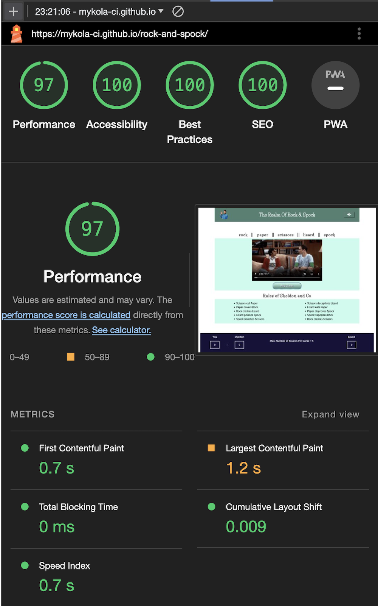
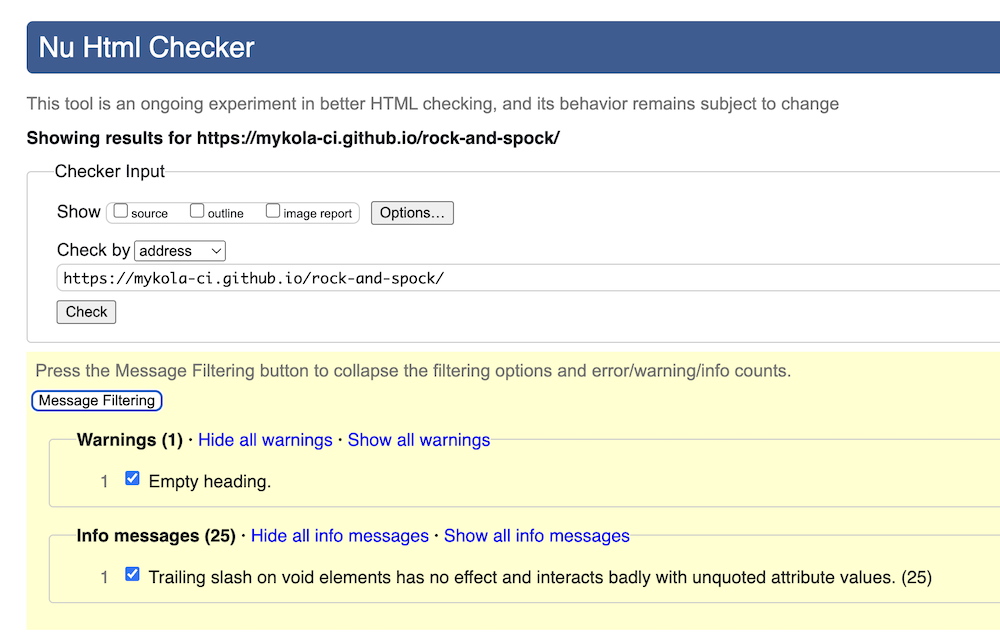
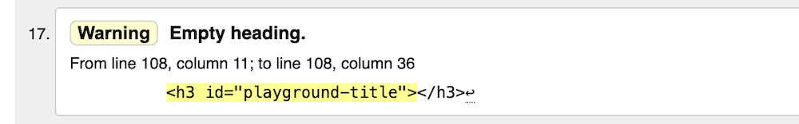

# Testing
## The Game Results And Scores
* I confirmed through manual testing that the Round results are always correct.

| Winning Hand | Index in the Array | Inferior Hand | Inferior Index| Status |
| --- | --- | --- | --- | --- |
| Rock | 0 | Lizard | 3 | Checked |
| Rock | 0 | Scissors | 2 | Checked |
| Paper | 1 | Rock | 0 | Checked |
| Paper | 1 | Spock | 4 | Checked |
| Scissors | 2 | Paper | 1 | Checked |
| Scissors | 2 | Lizard | 3 | Checked |
| Lizard | 3 | Paper | 1 | Checked |
| Lizard | 3 | Spock | 4 | Checked |
| Spock | 4 | Rock | 0 | Checked |
| Spock | 4 | Scissors | 2 | Checked |

_I further confirmed that_:
- the winning hand is defined correctly, and 
  - the correct message displays;
  - the Winner's score increments;
- if no hand picked by Player within 5 sec,
  - the correct message "No Hand Picked..." displays; 
  - the Computer's score increments;
- at times of Player's and Computer's indexes coincide,
  - the correct message "It's a tie" displays;
  - the scores do not change;
- hitting on the Start Round! button increments the count of Rounds.

* I confirmed through manual testing that the Game results are always correct.
  - After 5th Round Player is returned back to the Intro Screen;
  - the Footer at the Intro Screen displays number of Rounds played = 5 and the summary score of the opponents for the last 5 Rounds; 
  - the text message in the Footer displays the total number of full Games played and the score by Games pointing who of the opponents lead; 
  - when the score by Games happens to be a draw, the message "It's a tie" displays.
  - the total number of full games played and the scores by Game are stored and displayed at the end of each Game during entire session until full reload of the web-page 

* I confirmed that after full 5-round series the event of hitting on the Play Game! button clears all round scores including the Round count. 
* I confirmed that getting back to the Intro Screen from the Playground Screen and vice versa in the middle of the Game, i.e. before number of Rounds reaches 5, does not change the Round scores and the Round count.

## Utility Features
### Sounds and Video
I confirmed that:
* the web-page loads with all the sounds off
* the __Sound Toggle__ button always toggles the sounds on and off and available across all screens at the top right corner in the header section
* the web-page loads with the video NOT PLAYING and MUTED. Video controls work correctly: play/stop, sound on/off, captions on/off.

### Navigation
I checked and confirmed that
* The only gate from the _Intro screen_ is the button __Play Game!__
  - opens the _Input Name screen_ on the web-page load;
  - opens _Playground Screen_ after Player's name has been submitted.

*  The __Back to the Intro Page__ button on the _Playground Screen_ returns to the _Intro screen_

* The __Back to New Round__ button:
  - returns Player to the _Playground Screen_;
  - returns Player to the _Intro Screen_ if the number of rounds reaches 5.

## Compatibility, Browsers

I tested the application in the following browsers: Chrome, Firefox and Safari.

I tested the application on real devices such as: Desktop, MacBook Pro, iPad Mini, iPad Pro, Iphone 13, Iphone 12 Pro Max. 

I confirmed that 

* the titles, messages, scores, rules and instructions are all readable and easy to comprehend;
* the layouts are not broken and convenient for user experience.

## Lighthouse Testing

## Validators testing

There are 25 findings of html validator regarding trailing slash endings as  self-closing tags for the void elements. These are neither errors nor warnings. This issue has been widely debated throughout developer communities. It is said that trailing slashes may cause issues with unquoted attribute values, whereas self-closing tags are required in XHTML ([Mdn reference](https://developer.mozilla.org/en-US/docs/Glossary/Void_element)). 

I do not use unquoted attribute values, and I confirmed that these tags do not cause any bugs.

The warning refers to the empty heading

